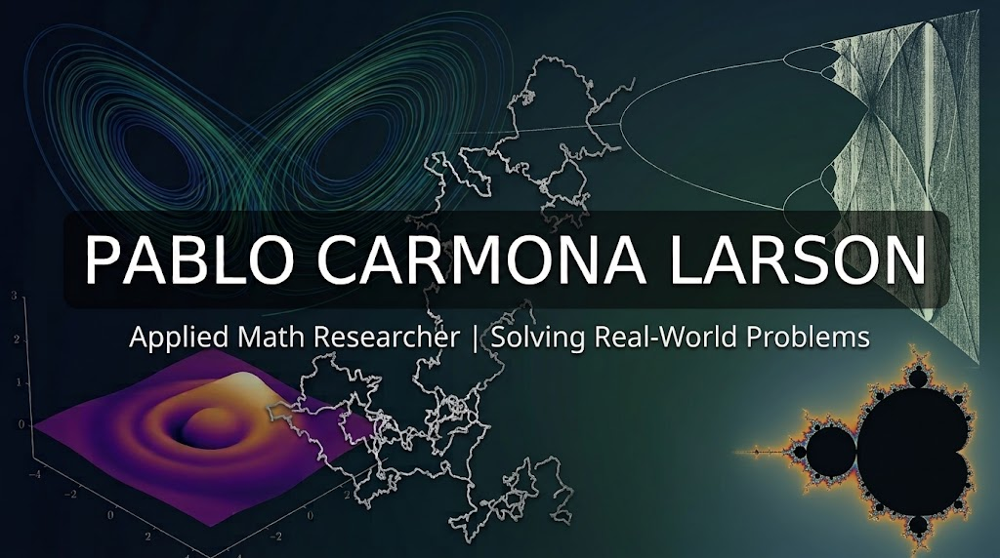

<!-- Imagen de cabecera -->

 

# 🌐 Advanced Mathematical Modeling
**Bridging abstract mathematics, scientific computing, and real-world applications.**

 

---

## 👨‍🎓 About Me

I am a **Mathematics graduate** currently pursuing a **Master's degree in Mathematics**. My academic path is driven by a strong interest in the interplay between rigorous theory and computational methods, with a particular focus on **mathematical analysis and modeling**.

Looking ahead, I intend to pursue an **international double master's degree** specialized in analysis and modeling, with the goal of building a solid foundation for research in applied mathematics and scientific computing.

- 🎓 **Background:** BSc in Mathematics
- 📚 **Currently:** MSc in Mathematics
- 🌍 **Next step:** International double master's in analysis and modeling
- 🔬 **Interests:** Dynamical systems, differential equations, optimization, stochastic calculus

---

## 📂 About This Repository

This repository brings **theoretical mathematics to real scientific applications**. Each project translates abstract results into models that describe, simulate, and help us understand phenomena from different fields of science.

### 🧭 Areas Covered

| Area | Description |
|:---|:---|
| 🔄 **Dynamical Systems** | Qualitative analysis, stability, bifurcations, and long-term behavior |
| 📐 **Differential Equations (ODEs / PDEs)** | Analytical study and numerical solution of ordinary and partial differential equations |
| 🎯 **Optimization** | Variational methods, convex and non-convex problems, and numerical algorithms |
| 🎲 **Stochastic Calculus** | Random processes, stochastic differential equations, and probabilistic modeling |

### ✨ What to Expect from Each Project

> Every project includes **both** the rigorous mathematical context and justification needed to understand it, **and** a complete code implementation.

- 📖 **Mathematical foundations:** problem statement, assumptions, theory, and justification of the model.
- 💻 **Implementation:** reproducible code, primarily in **Python, MATLAB, FreeFEM++, Wolfram Mathematica, or R**.
- 📊 **Results & analysis:** simulations, visualizations, and interpretation of the outcomes.

---

## 🛠️ Skills & Tech Stack

### 💻 Programming & Scientific Computing

### 🧮 Numerical Methods & Symbolic Computation

### 📝 Scientific Writing

---

## 📬 Let's Connect

 

*"Mathematics is the language in which the universe is written."*

